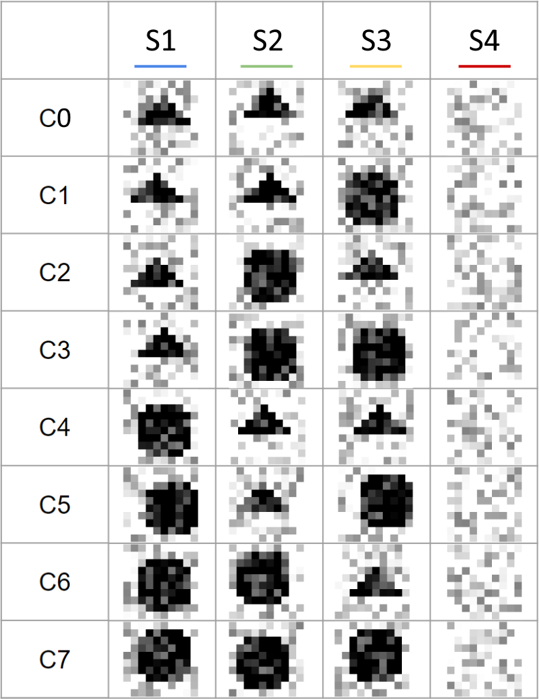

# Sequential models for classification tasks based on Neural Production Systems principle

## Installation
This code is developed with python 3 and the following libraries:
```
torch
numpy
pandas               (for tabular tasks)
xlrd                 (to load Cardiotocography dataset)
PIL                  (for slots recognitions tasks)
```

## Type of tasks

### Images
We consider 2 datasets in this type of task: MNIST and CIFAR10.
Each image is split into patches with a configurable size.
At each iteration, the goal is to select a patch, apply a transformation on it and update the accumulator (primary slot).

Here is an example of splitting with the hyperparameters given below.


To run this experiment, you need to launch `main.py` script in the `Tests on Images` folder.
<details><summary>As for example</summary>
<p>

```bash
python main.py --use_autoencoder True --n_slots 49 --n_iter 10 --n_rules 50 --input_mlp "" --s_dim 8 --pos_dim 12 --r_dim 12 --rule_mlp_dim 64 --use_null_rule False --dim_attn_r 32 --dim_attn_c 32 --tau_train_r 5. --tau_eval_r 0.0 --tau_train_c 5. --tau_eval_c 0.0 --query_r "Sp" --keys_c "POS" --query_c "Sp" --hard_gs_train_r True --hard_gs_eval_r True --hard_gs_train_c True --hard_gs_eval_c True --tpr_order 3 --simplified False --reversed_attn False --stddev_noise_r 0.0 --stddev_noise_c 0.0 --lr 0.001 --epochs 50 --bs 256 --seed 0 --use_entropy False --replace_mode False --force_gpu False --train_size 60000 --test_size 10000 --data_shuffle True --data_path "./data/" --save True --save_path "./" --save_name "MNIST TASK" --encoder_callback_name "Patches_encoded_callback" --encoder_callback_args "4,4" --autoencoder_module_name "cnn_encoder_decoder_4x4" --dataloader_module_name "mnist_dataset" --dataloader_sup_args '' --n_classes 10 --sp_dim None --do_test True --save_model False --k_fold 2
```
For MNIST Task. The hyperparameters are described below.
</p>
</details>

### Tabular data
We consider 3 datasets in this type of task: Letter, Cardiotocography and Musk from UCI datasets.
At each iteration, the model selects a feature to transform and update the accumulator (primary slot) accordingly.

To run this experiment, you need to launch `main.py` script in the `Tests on Tabular data` folder.
<details><summary>As for example</summary>
<p>

```bash
python main.py --use_autoencoder False --n_slots 21 --n_iter 8 --n_rules 50 --input_mlp "" --s_dim 8 --pos_dim 12 --r_dim 12 --rule_mlp_dim 64 --use_null_rule False --dim_attn_r 32 --dim_attn_c 32 --tau_train_r 5. --tau_eval_r 0.0 --tau_train_c 5. --tau_eval_c 0.0 --query_r "Sp" --keys_c "POS" --query_c "Sp" --hard_gs_train_r True --hard_gs_eval_r True --hard_gs_train_c True --hard_gs_eval_c True --tpr_order 3 --simplified False --reversed_attn False --stddev_noise_r 0.0 --stddev_noise_c 0.0 --lr 0.001 --epochs 10 --bs 256 --seed 0 --use_entropy False --replace_mode False --force_gpu False --train_size 1776 --test_size 350 --data_shuffle True --data_path "./Cardiotocography/CTG.xls" --save True --save_path "./" --save_name "test" --encoder_callback_name "Transform_encoded_callback" --encoder_callback_args "" --autoencoder_module_name "mlp_encoder_decoder" --dataloader_module_name "cardio_dataset" --dataloader_sup_args '' --n_classes 10 --sp_dim None --do_test True --save_model False --k_fold 2
```
For Cardiotocography task (hyperparameters meaning described below).
</p>
</details>

### Slots Recognitions
We consider 2 sub-tasks that contain one dataset given as an example.
One sub-task is composed of MNIST images, where each image is considered as a slot and the goal is to distinguish classes from each other depending on the content in their slot at a specific position.
The other sub-task lies on the same principle, with the use of geometric shapes (with some variations) that are generated instead of MNIST images that are more complicated.

Here is an example of a geometric task used with the hyperparameters given below.



To run this experiment, you need to launch `main.py` script in the `Tests on Slots Recognitions tasks` folder.
<details><summary>As for example</summary>
<p>

```bash
python main.py --use_autoencoder False --n_slots 4 --n_iter 8 --n_rules 50 --input_mlp "" --s_dim 8 --pos_dim 12 --r_dim 12 --rule_mlp_dim 64 --use_null_rule False --dim_attn_r 32 --dim_attn_c 32 --tau_train_r 5. --tau_eval_r 0.0 --tau_train_c 5. --tau_eval_c 0.0 --query_r "Sp" --keys_c "POS" --query_c "Sp" --hard_gs_train_r True --hard_gs_eval_r True --hard_gs_train_c True --hard_gs_eval_c True --tpr_order 3 --simplified False --reversed_attn False --stddev_noise_r 0.0 --stddev_noise_c 0.0 --lr 0.001 --epochs 3 --bs 64 --seed 0 --use_entropy False --replace_mode False --force_gpu False --train_size 400 --test_size 100 --data_shuffle True --save True --save_path "./" --save_name "test" --encoder_callback_name "Slots_encoded_callback" --autoencoder_module_name "cnn_encoder_decoder_geometric" --dataloader_module_name "geometric_dataset" --module_data_name "geometric_task1" --dataloader_sup_args '' --sp_dim None --do_test True --save_model False --k_fold 0
```
For the Geometric dataset (hyperparameters meaning described below).
</p>
</details>

## Hyperparameters

### List of informations useful in the attentions and for the MLPs (rule application)
| Notations | Meaning |
| :-: | :-: |
| S | Slots content (primary slot excluded) |
| Sp | Primary slot content |
| Sc | Content of the contextual slot currently selected |
| POS | Embedding representing the location/differentiation of the slots |
| R | Rule embeddings |
| Yhat | Current prediction (in function of the current primary slot) |
| Iter | Current iteration (one-hot vector) |
| Svst | Slots (primary slot excluded) currently visited (counter in a vector) |
| Rvst | Rules currently visited (counter in a vector) |

### Description

#### Dimensions
```Text
n_slots (Integer):			Number of slots to use (in total)
n_iter (Integer):			Number of iterations to use
n_rules (Integer):			Number of rules to use (in total)
sp_dim (Integer/None):		Dimension of the primary slot
s_dim (Integer):			Dimension of each slot
pos_dim (Integer):			Dimension of the embeddings of each contextual slot
r_dim (Integer):			Dimension of the rule embedding (for each rule)
rule_mlp_dim (Integer):		Dimension of the hidden layer for each MLP (ignored if not used)
dim_attn_r (Integer):		Dimension of the projection space for the rule selection attention
dim_attn_c (Integer):		Dimension of the projection space for the contextual slot selection attention
dim_key_r (Integer/None):	3rd dimension of the key attention for rule selection (None or num_slots-1 or 1)
dim_query_r (Integer/None): 3rd dimension of the query attention for rule selection (None or num_rules)
dim_key_c (Integer/None):	3rd dimension of the key attention contextual slot selection (None or num_slots-1 or 1)
dim_query_c (Integer/None):	3rd dimension of the query attention contextual slot selection (None or 1)
stddev_noise_r (Float):		Level of noise to add on the attention for the rule selection
stddev_noise_c (Float):		Level of noise to add on the attention for the contextual slot selection
```

#### Architecture
```Text
query_r* (String):							Definition of the query-ies attention for the rule selection
keys_c* (String):							Definition of the keys attention for the contextual slot selection
query_c* (String):							Definition of the query-ies attention for the contextual slot selection
input_mlp* (String):						Definition of the MLP inputs (for the rules)
use_null_rule (Boolean):					Whether to use a null rule (would be the last rule)
tpr_order (Integer/None):					Using TPR order (value in [None, 0, 2, 3])
use_mlp_rules (Boolean):					Whether to use a MLP for the rules
scores_constraint_pos_visited (Boolean):	Whether to use a constraint over the usage of positional encoding of contextual slots to don\'t the same positional encoding in the next iterations
use_pos_onehot (Boolean):					Whether to use onehot encoding for the positional encoding of contextual slots (else use an learned embedding)
simplified (Boolean):						Whether to use the simplified architecture
reversed_attn (Boolean):					Using the reversed attention architecture
```

\*These hyperparameters use strings which are noted in the table above. It is possible to concatenate information by adding a comma. For example, you can concatenate slots and their embeddings with: `S,POS`, for each slot its embedding will be concatenated.

#### Gumbel Softmax
```Text
tau_train_r (Float):					Temperature of the Gumbel Softmax for the rule selection during training
tau_eval_r (Float): 					Temperature of the Gumbel Softmax for the rule selection during evaluation
tau_train_c (Float): 					Temperature of the Gumbel Softmax for the contextual slot selection during training
tau_eval_c (Float): 					Temperature of the Gumbel Softmax for the contextual slot selection during evaluation
tau_strat_update_train_r (String/None): Temperature evolution strategy for the rule selection during training (replace tau_train_r if specified), for example: 'exp_dec(50., 0.1, 0.05)' or 'lin_dec(50., .1, 1.)'
tau_strat_update_eval_r (String/None): 	Temperature evolution strategy for the rule selection during evaluation (replace tau_eval_r if specified)
tau_strat_update_train_c (String/None):	Temperature evolution strategy for the contextual slot selection during training (replace tau_train_c if specified)
tau_strat_update_eval_c (String/None): 	Temperature evolution strategy for the contextual slot selection during evaluation (replace tau_eval_c if specified)
hard_gs_train_r (Boolean):	 			Whether to use a hard Gumbel Softmax for the rule selection during training
hard_gs_eval_r (Boolean): 				Whether to use a hard Gumbel Softmax for the rule selection during evaluation
hard_gs_train_c (Boolean): 				Whether to use a hard Gumbel Softmax for the contextual slot selection during training
hard_gs_eval_c (Boolean): 				Whether to use a hard Gumbel Softmax for the contextual slot selection during evaluation
```
#### Autoencoder
```Text
use_autoencoder (Boolean): 				Whether to use the autoencoder during training
encoder_callback_name (String/None):	The name of the class of the encoder callback in "tables_utils" (None if no encoder)
encoder_callback_args (String/None):	The arguments to give in the constructor of the encoder callback class
autoencoder_module_name (String/None):	The name of the file where there are the encoder and decoder definition (functions named: "get_encoder" and "get_decoder")
```

#### Learning
```Text
k_fold* (Integer):		Number of fold in the training dataset
lr (Float):				Learning rate
epochs (Integer):		Number of epochs
bs (Integer):			Batch size
seed (Integer):			Seed
use_entropy (Boolean):	Whether to use the entropy in the loss
replace_mode (Boolean):	Whether to use the replacing mode (using adding mode otherwise)
force_gpu (Boolean):	Whether to force the usage of GPU
```

\*`k_fold` hyperparameter should be greater or equal to 2 to be effective. Otherwise, if it is equal to 1, a simple split train, eval, test split is performed with the data used for training (train+eval) are split with the percentage: 2/3 train + 1/3 eval. And if it is equal to 0, there is no evaluation during the training.

#### Dataset
```Text
train_size (Integer):				Size of the training dataset
test_size (Integer):				Size of the test dataset
do_test (Boolean):					Whether to do a test at the end of the training phase
data_path (String):					Data path (relative or absolute path)
data_shuffle (Boolean):				Whether to shuffle the data
n_classes (Integer): 				The number of classes in the tasks
dataloader_module_name (String):	The name of the file to load the datasets (should contain a function called "get_dataloaders")
dataloader_sup_args (String/None):	The arguments to give at the function "get_dataloaders" from the module "dataloader_module_name"
module_data_name (String):			Name of the module (filename) in which the data are defined
```

#### Saving
```Text
save (Boolean):			Whether to save the statistics of the training/evaluation and the model properties
save_path (String):		The path of the statistics to save
save_name (String):		The name of the file to save
save_model (Boolean):	Whether to save the model with the statistics
```

## Reference

This work is based on previous work introducing the [Neural Production Systems](https://github.com/anirudh9119/neural_production_systems) from the paper [Neural Production Systems: Learning Rule-Governed Visual Dynamics](https://arxiv.org/abs/2103.01937).
